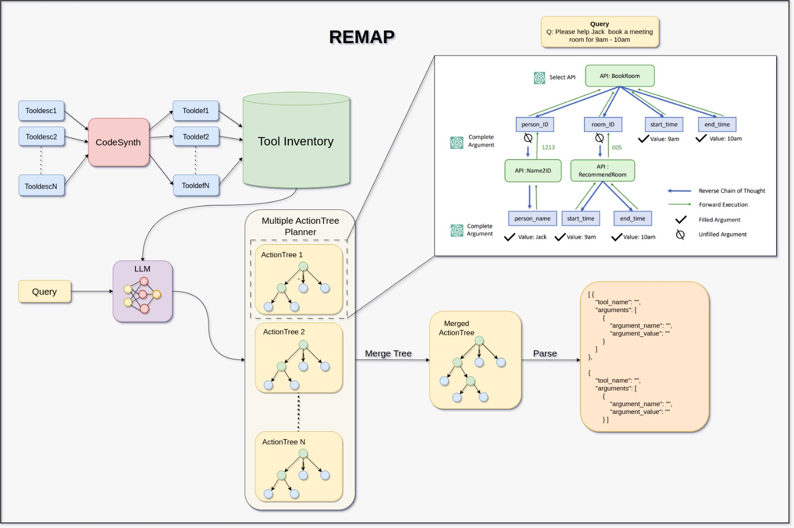

# SwissNYF
Large Language Models augmented with Function calling capabilities have opened doors to a new paradigm of application development across various domains due to their ability to execute a user query by planning a chain of function calls only using their Natural Language Understanding. 

## Usage

### Installing Library
```bash
$ pip install -e SwissNYF/
```

### Docs
### run_query
```bash
$ python -m swissnyf.run_query --config ./config.yaml \
                               --tools ./tools.yaml \
                               --pipeline topgun\
                               --retriever instructxl\
                               --input ./input.txt\
                               --output ./output.jsonl\
                               --query "Prioritize the submission of Devrev report"\
                               --llm openai\
                               --verbose True
```
```
usage: run_query.py [-h] [--config CONFIG] [--tools TOOLS] [--pipeline PIPELINE] [--retriever RETRIEVER]
                    [--input INPUT] [--output OUTPUT] [--query QUERY] [--llm LLM] [--verbose VERBOSE]

options:
  -h, --help            show this help message and exit
  --config CONFIG       Location of the config file, Defaults to our custom config
  --tools TOOLS         Location of the tools file, Defaults to devrev tools in PS
  --pipeline PIPELINE   Name of Pipeline options: topgun/reversechain
  --retriever RETRIEVER Name of the retrieving technique options: gear / toolbench / instructxl
  --input INPUT         A txt file with queries you want to run, defaults to devrev queries
  --output OUTPUT       Output json file for solution, defaults to ./outputs.jsonl
  --query QUERY         If you do not want to run pipeline only on 1 query and do not pass input
  --llm LLM             Specify llm service provider Defaults to openai options: azure/openai
  --verbose VERBOSE     to turn on verbose
```


#### Configs

|Flag             |Values                      |Description                               
|:----------------|:--------------------------:|:----------------------------------------
|tools            |  data/tools.yaml           | tool descriptions                        
|pipeline         |  reversechain/topgun       | method to use for solving the query
|retriever        |  gear/toolbench/instructxl | retrieval strategy
|input            |  data/input.jsonl          | file containing the queries 
|output           |  output.jsonl              | output file
|query            |  query                     | query string
|llm              |  azure/openai              | llm to be used
|verbose          |  False/True                | verbose


### add_secrets
Use this when you would like to add new secrets we have already loaded your secrets so please do not use until neccessary
```bash
$ python -m swissnyf.add_secrets
```
This opens a template of .env file with out the previous keys. If there was any previous keep this clears them. **This is done through nano do not run on colab or notebook**.

### edit_secrets
This is to edit your existing secrets we have provided or if you have changed use this command
```bash
$ python -m swissnyf.edit_secrets
```
This opens a the previously set secrets file to continue editting. **This is done through nano do not run on colab or notebook**.

### edit_configs
This is to edit our default configs that we used for evaluation. Values are the same as given in <a href="#configs">configs</a> so keep in mind and edit it based on it. You can override this through passing args in <a href="#run_query">run_query</a>

```bash
$ python -m swissnyf.edit_configs
```
```diff
- This is done through nano do not run on colab or notebook.
```
### edit_tools
This is to edit your existing tool definition, you can overide this tools def by passing tools yaml in <a href="#run_query">run_query</a>. By setting it here by default these definitions will be used
```bash
$ python -m swissnyf.edit_tools
```
```diff
- This is done through nano do not run on colab or notebook.
```


## Approach
The major constraints and challenges we faced are below:
- **No API Definition:** The solution operates without explicit function definitions, relying solely on tool descriptions.
- **Dynamic Tool Integration:** The platform adapts to API changes, additions, and removals, ensuring flexibility.
- **Comprehensive Tool Coverage:** The solution accommodates diverse tools, irrespective of popularity or type.
- **Performant Inference:** Real-time, robust inference is a prerequisite, optimizing LLM calls for efficiency.
- **Accuracy:** The code response must align accurately with the query for solution acceptance.

Hence, we have employed **Reverse Chain**, which employes effective use of API selection and argument filling for tool selection.
It's pipeline consists of :
- **Tool Inventory**: Tools generated by CodeSynth via tool definitions.
- **ActionTree**: Tree build by Reverse Chain in reverse order of solution. 
- **Multi-ActionTree Planning**: To address query with multiple independent tasks, use multiple action trees.
- **Merge ActionTrees**: LLM takes in multiple aciton trees and orignal query to build a final solution.
- **Parsing**: Merged Tree is pared into the JSON format in the correct.




 and **TOPGUN** which relies on code generation capabilities of LLMs to effectively find solution to a query. It includes the following parts:
 
- **Tool Inventory**: Tools generated by CodeSynth via tool definitions.
- **Code-Driven Reasoning**: Instruct the LLM to generate a logical code using the correct combination of pseudo functions to solve the query.
- **Function Call Stack**: Stores the call sequence of the executable generated code, in a tree structure
- **Parsing**: Tree is parsed to obtain the final JSON format in correct order.


## Contributors
- [Somnath Kumar](https://github.com/hex-plex)
- [Eshaan Agarwal](https://github.com/eshaanagarwal)
- [Vaibhav Tripathi](https://github.com/oyetripathi)
- [Dhruv Jain](https://github.com/maximus-21)
- [Raunak Pandey](https://github.com/patrick-batman)
- [Aakash Sharma](https://github.com/Aacashh)
- [Vidit Khandelwal](https://github.com/TheVidz)
- [Sanjana Garai](https://github.com/sanjanagarai)
